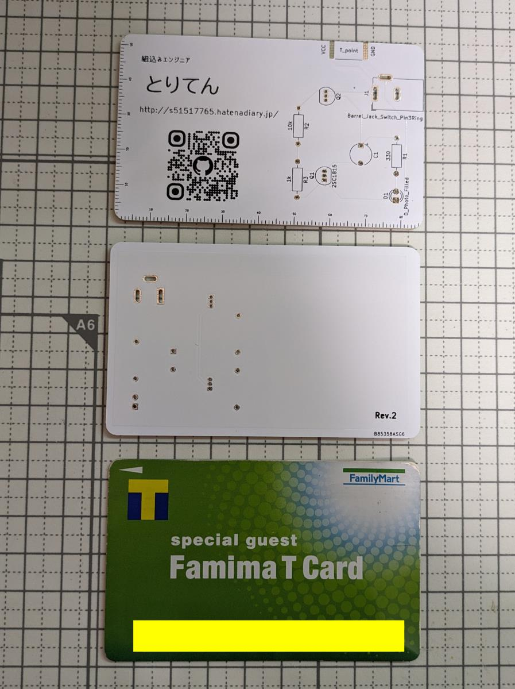

# Business card size board (LED flasher)

## 概要 (Overview)

クレジットカードサイズ基板でLEDが点滅します

## 実物イメージ (Image)

## 技術的解説 (Technical explanation)

設計編 https://s51517765.hatenadiary.jp/entry/2023/12/11/073000
発注編 
実装編 

## 部品リスト（Parts list）

|部品|種類|数量|
|---|---|---|
|トランジスター|NPN (2SC1815)|1|
|トランジスター|PNP (2SA1015)|1|
|抵抗|10kΩ|1|
|抵抗|1kΩ|1|
|抵抗|330Ω|1|
|コンデンサ|470uF|1|
|LED|任意※|1|
|DCジャック|センタープラス|1|

※ただしVfによっては330Ω抵抗を調整すること

## ライセンス (License)

This software is released under the MIT License, see LICENSE.
